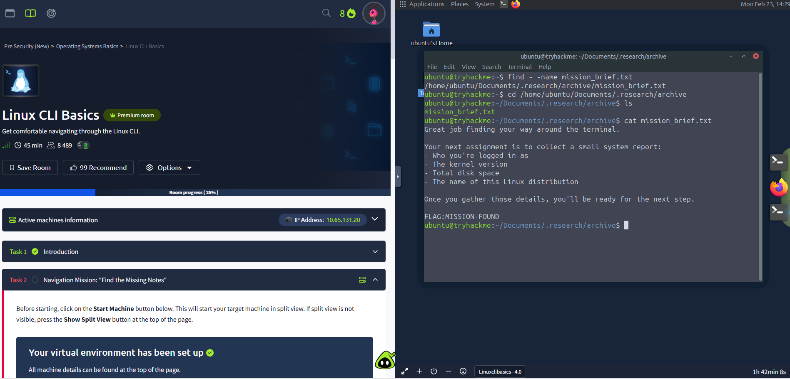

# TryHackMe Room: Linux CLI Basics

## Objective
Learn basic Linux command-line operations and navigation to build foundational skills for cybersecurity labs.

## Tools Used
- Linux terminal (Ubuntu VM)
- TryHackMe platform

## Steps Taken
1. Completed file and directory navigation commands (`ls`, `cd`, `pwd`)
2. Learned text commands (`cat`, `nano`)
3. Practiced file manipulation (`mkdir`, `rm`, `cp`, `mv`)
4. Checked system info (`whoami`, `uname -a`, `top`)

## Challenges
- Remembering all navigation shortcuts

## Screenshots
Below is one of the screenshot from the room demonstrating exercises:

